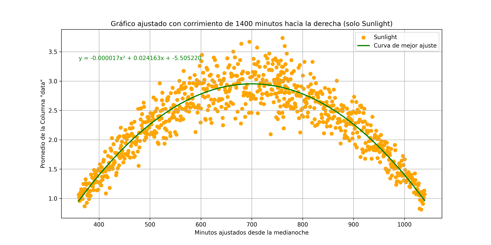

## Función de densidad de probabilidad

Para determinar la función de densidad de probabilidad del proceso aleatorio, es importante primero determinar el modelo de distribución del proceso. Esto se logra a través de la función fitter aplicado a los datos recopilados mediante el programa ```distribucion.py``` el cual se muestra a continuación:

```python title="distribucion.py"
import pandas as pd
import sqlite3
from fitter import Fitter

# Conectar a la base de datos y cargar la tabla en un DataFrame
conn = sqlite3.connect('proyecto.db')
df = pd.read_sql_query("SELECT * FROM test_data", conn)
conn.close()

# Filtrar los datos para minutes_from_midnight = 626.05
target_minutes = 460.1
filtered_data = df[df['minutes_from_midnight'] == target_minutes]['data'].dropna()

# Verificar si hay datos disponibles después del filtro
if filtered_data.empty:
    print(f"No se encontraron datos para minutes_from_midnight = {target_minutes}.")
else:
    # Seleccionar las distribuciones que quieres probar
    distributions = [
        'norm', 'expon', 'gompertz', 'levy',
        'logistic', 'rayleigh'
    ]
    
    # Ajustar las distribuciones a los datos de 'filtered_data'
    f = Fitter(filtered_data, distributions=distributions)
    f.fit()  # Ajusta las distribuciones a los datos

    # Obtener la mejor distribución para estos datos
    best_dist = f.get_best()
    best_dist_name = list(best_dist.keys())[0]  # Nombre de la mejor distribución
    best_dist_params = best_dist[best_dist_name]  # Parámetros de la mejor distribución

    # Imprimir el resultado
    print(f"Para minutes_from_midnight = {target_minutes}, la mejor distribución es: "
          f"{best_dist_name}, con los parámetros: {best_dist_params}")
```

Este código permite obtener el modelo de distribución que mejor se ajusto con base en los modelos posibles para el proceso. Al realizar diversas pruebas con distintos valores de tiempo, se observa que la distribución que mejor se ajusta es la exponencial "expon", algunos rezultados de las pruebas realizadas a tres instantes distintos se muestran a continuación:

```Para minutes_from_midnight = -649.85, la mejor distribución es: expon, con los parámetros: {'loc': 0.12535911861064752, 'scale': 2.8123496320947368}``` 

```Para minutes_from_midnight = -54.45, la mejor distribución es: expon, con los parámetros: {'loc': 0.02121149149570576, 'scale': 0.812807395554624} ```

```Para minutes_from_midnight = 114, la mejor distribución es: expon, con los parámetros: {'loc': 0.022537642544328218, 'scale': 0.9522438596968169}```

```Para minutes_from_midnight = 553.5, la mejor distribución es: expon, con los parámetros: {'loc': 0.04768446100892672, 'scale': 2.6305185025999633}```

Como se observa, los parámetros de la distribución cambian con el tiempo y siguen la función de densidad de probabilidad exponencial. Utilizando el programa ```parameters.py``` se crea una nueva base de datos llamada ```parameters.db``` cuya tabla es ```parameters_data```. Se extraen los datos de timestamp, minutes_from_midnight y sunlight de ```proyecto.db``` y luego, con el programa ``` parameters_expon.py``` se calculan los parámetros ```loc``` y ```scale``` de los datos según su timestamp siguiendo una distribución exponencial aprovechando el comando ```fit.expon``` 

Una vez sabiendo el modelo de la distribución, cuya función de densidad de probabilidad sigue la siguiente ecuación:

$$f(x, \lambda) =
\begin{cases}
\lambda e^{-\lambda x}, & \text{si } x \geq 0 \\
0, & \text{si } x < 0
\end{cases}$$

donde $\lambda$ depende del tiempo, es decir que se puede reescribir de la siguiente forma:

$$f(x, \lambda(t)) =
\begin{cases}
\lambda(t) e^{-\lambda(t) x}, & \text{si } x \geq 0 \\
0, & \text{si } x < 0
\end{cases}$$

Ahora, para encontrar el parámetro $\lambda$ se utiliza la media temporal variante, es decir cuando sunlight=1. Para ello, se apela a la siguiente figura:



Por teoría, se sabe que la ecuación de ajuste observada en la gráfica es $\mu(t)$ y que existe una relación entre el parámetro $\lambda$ y $\mu$ como se muestra en la siguiente ecuación:

$$
\mu(t) = \frac{1}{\lambda(t)}
$$

$$
\lambda(t) = \frac{1}{-0,000017t^{2}+0,024163t-5,505220}
$$

Finalmente, la función de densidad de probabilidad quedaría de la siguiente manera:

$$f(t, \lambda(t)) =
\begin{cases}
\left(\frac{1}{-0,000017t^{2}+0,024163t-5,505220}\right)e^{-\left(\frac{1}{-0,000017t^{2}+0,024163t-5,505220}\right)t}, & \text{si } t \geq 0 \\
0, & \text{si } t < 0
\end{cases}$$
