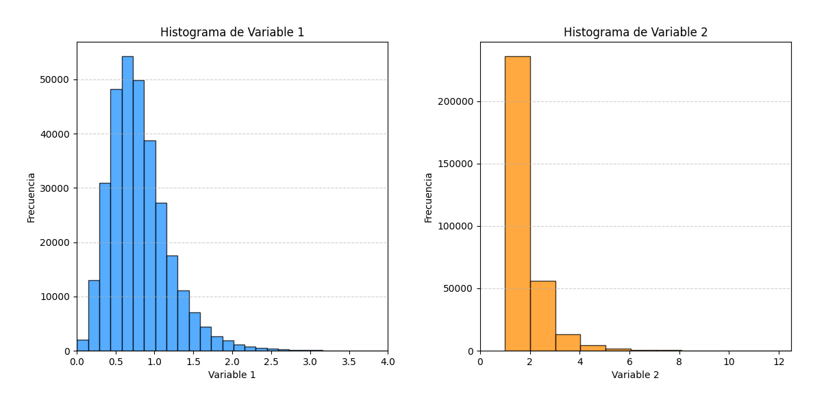
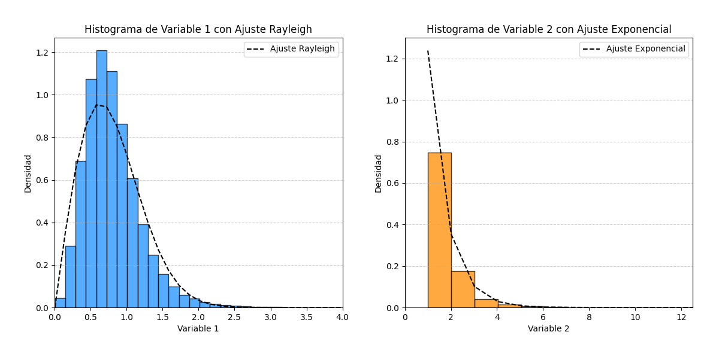

# Recopilación, almacenamiento de datos y gráficas descriptivas

En este apartado se documentará cómo se recopilaron los datos y se explorarán los programas `.py`diseñados para la creación de gráficas e histogramas. A continuación se explicarán las librerías utilizadas para confeccionar la lógica de programación para los programas creados externos a los brindados en el repositorio

### **1. Pandas**

Pandas es una librería de python que facilita la manipulación y el análisis de datos. Proporciona herramientas que facilita el trabajo con tablas de datos.

Enfocado a aspectos del proyecto, pandas permite seleccionar y filtrar, a través de comandos y de forma sencilla los conjuntos de datos que me interesan de una tabla. Por ejemplo los datos de la primera columna o de la segunda según sea el caso.

### **2. SQLalchemy**

SQLAlchemy es una biblioteca de Python para trabajar con bases de datos relacionales. Es un ORM (Object Relational Mapper) que proporciona una capa de abstracción entre el código Python y las bases de datos. Algunas características clave de SQLAlchemy son:

1. Compatibilidad con múltiples bases de datos (MySQL, PostgreSQL, SQLite, etc.)
2. Mapeo objeto-relacional (ORM) para interactuar con la base de datos usando objetos Python
3. Expresión SQL para construir consultas complejas de manera programática
4. Soporte para transacciones y conexiones pooling
5. Herramientas para migración de esquemas de base de datos

### **3. Matplotlib**

Matplotlib es una biblioteca de visualización de datos en Python, diseñada para crear gráficos estáticos, animados e interactivos de alta calidad. Es una de las herramientas más populares para la visualización de datos en el ecosistema científico de Python. Uno de los aspectos más útiles es que permite crear una amplia gama de gráficos, incluyendo gráficos de líneas, de barras, de dispersión, histogramas, gráficos de pastel, gráficos 3D, y muchos más.

En resumen, integra aspectos propios de matlab en el ambiente de python para facilitar la creación de gráficos y el manejo de datos cómo se realiza en la plataforma de matlab.
### Gráficas descriptivas de las variables 1 y 2

A continuación se muestra el código empleado para la generación de los histogramas a partir de los datos guardados en base de datos.

```python title="graficas_descriptivas"
import pandas as pd
import matplotlib.pyplot as plt

# Cargar la base de datos
db_path = 'proyecto.db'  # Asegúrate de que la ruta sea correcta
data = pd.read_sql('SELECT variable_1, variable_2 FROM test_data', 'sqlite:///' + db_path)

# Crear figura con tamaños ajustados
plt.figure(figsize=(12, 6))

# Crear histograma para variable_1
plt.subplot(1, 2, 1)
plt.hist(data['variable_1'], bins=70, color='dodgerblue', edgecolor='black', alpha=0.75)  # Bins para variable 1 en 70
plt.title('Histograma de Variable 1')
plt.xlabel('Variable 1')
plt.ylabel('Frecuencia')
plt.xlim(0, 4)  # Limitar el eje X para ver mejor la estructura del histograma
plt.grid(True, axis='y', linestyle='--', alpha=0.6)  # Añadir una cuadrícula ligera en el eje Y

# Crear histograma para variable_2 con más bins
plt.subplot(1, 2, 2)
plt.hist(data['variable_2'], bins=100, color='darkorange', edgecolor='black', alpha=0.75)  # Aumentar bins a 100 para variable 2
plt.title('Histograma de Variable 2')
plt.xlabel('Variable 2')
plt.ylabel('Frecuencia')
plt.xlim(0, 12.5)  # Limitar el eje X para ver mejor la estructura del histograma
plt.grid(True, axis='y', linestyle='--', alpha=0.6)  # Añadir una cuadrícula ligera en el eje Y

# Ajustar diseño y mostrar gráficas
plt.tight_layout(pad=3.0)  # Aumentar separación entre gráficas
plt.show()
```
Se añadieron más "bins" al programa con el fin de poder visualizar más rectángulos y observar mejor la distribución de probabilidad. Esto le da mayor resolución:



Observando las figuras y la curva de mejor ajuste, se puede deducir que, los modelos de distribución son Rayleigh para la variable 1 y Exponencial para la variable 2. Esto se puede observar de mejor manera en el cuadro a continuaicón, que resume los resultados anteriores.

|                  | `variable_1`  | `variable_2`  |
|-------------------------|---------------|---------------|
| **Modelo**               | Rayleigh      | Exponencial      |

