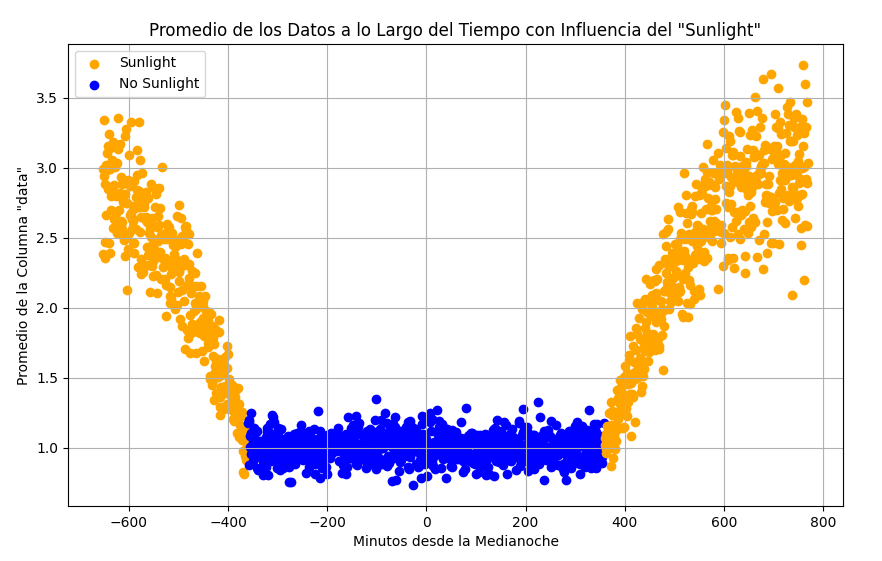

## Procesos aleatorios 
En esta segunda parte del proyecto, se buscan estudiar los procesos aleatorios y aspectos de suma importancia como es el caso de la función de densidad de probabilidad de un proceso aleatorio, definir si un proceso es ergódigo, si es estacionario en sentido amplio y la función de densidad de potencia.

Durante esta sección se estudiarán 3 puntos escenciales:

1. Determinación de la función de densidad de probabilidad
2. Determinación de la estacionaridad en sentido amplio y ergodicidad
3. Determinación de potencia promedio

Para cumplir con los puntos anteriormente descritos, se debe primero recopilar durante 24 horas los datos de una API y guardarlos en una base de datos. Luego, se convierte el timestamo de los datos a minutos respecto a la media noche del día siguiente. Es decir que, si la toma de datos inició en 2024/11/13 el minuto 0 está dispuesto para 2024/11/14 00:00:00. Entonces, si la toma inició a la 1 de la tarde del 13 de noviembre del 2024, el valor en la columna "minutes_from_midnight" para este valor será -620 minutos. para el caso de la 1 de la tarde del 14 de noviembre, el valor será de 780 minutos. Esto se logra gracias al código que se muestra a continuación:

```python title="time_since_12.py"
import pandas as pd
import sqlite3

# Conectar a la base de datos y cargar la tabla en un DataFrame
conn = sqlite3.connect('proyecto.db')
df = pd.read_sql_query("SELECT * FROM test_data", conn)

# Convertir 'timestamp' a formato datetime si no lo está ya
df['timestamp'] = pd.to_datetime(df['timestamp'])

# Definir la medianoche del 14 de noviembre de 2024 (sin necesidad de recalcular en cada fila)
midnight_nov_14 = pd.to_datetime('2024-11-14 00:00:00')

# Vectorización: Calcular los minutos en función de si es antes o después de la medianoche
before_midnight = df['timestamp'] < midnight_nov_14
after_midnight = ~before_midnight

# Calcular minutos negativos para los valores antes de la medianoche
df.loc[before_midnight, 'minutes_from_midnight'] = (df.loc[before_midnight, 'timestamp'] - midnight_nov_14).dt.total_seconds() / 60

# Calcular minutos positivos para los valores después de la medianoche
df.loc[after_midnight, 'minutes_from_midnight'] = (df.loc[after_midnight, 'timestamp'] - midnight_nov_14).dt.total_seconds() / 60

# Depuración limitada a las primeras filas
print("Ejemplo de cálculos:")
print(df[['timestamp', 'minutes_from_midnight']].head(10))

# Guardar el DataFrame actualizado en la base de datos
df.to_sql('test_data', conn, if_exists='replace', index=False)
conn.close()

print("Base de datos actualizada con la nueva columna 'minutes_from_midnight'.")
```

## Promedio temporal

Gracias a la nueva columna recientemente añadida, se pueden separar los datos en bloques de 100 desde el primer bloque y calcular el promedio de cada punto y observarlo en una gráfica. Esto se logra gracias al siguiente código:

```python title="promedio_temporal.py"
import pandas as pd
import sqlite3
import matplotlib.pyplot as plt

# Conectar a la base de datos y cargar la tabla en un DataFrame
conn = sqlite3.connect('proyecto.db')
df = pd.read_sql_query("SELECT * FROM test_data", conn)

# Asegurarse de que la columna 'minutes_from_midnight' esté calculada
# (debe estar calculada previamente como en los pasos anteriores)

# Agrupamos los datos en bloques de 100 elementos
df['group'] = df.index // 100  # Crear un grupo por cada 100 datos

# Calcular el promedio de 'data' para cada grupo de 100 datos y asociarlo con 'minutes_from_midnight'
grouped_data_avg = df.groupby('group').agg(
    avg_data=('data', 'mean'),  # Promedio de la columna 'data'
    minutes_from_midnight=('minutes_from_midnight', 'first'),  # Tomamos el primer valor de 'minutes_from_midnight' para cada grupo
    sunlight=('sunlight', 'first')  # Tomamos el primer valor de 'sunlight' para cada grupo
)

# Crear una lista de colores basada en la columna 'sunlight'
grouped_data_avg['color'] = grouped_data_avg['sunlight'].apply(lambda x: 'orange' if x else 'blue')

# Graficar el promedio de 'data' a lo largo de 'minutes_from_midnight'
plt.figure(figsize=(10, 6))

# Graficamos con los colores basados en 'sunlight'
for i, row in grouped_data_avg.iterrows():
    plt.scatter(row['minutes_from_midnight'], row['avg_data'], color=row['color'])

# Etiquetas y título
plt.xlabel('Minutos desde la Medianoche')
plt.ylabel('Promedio de la Columna "data"')
plt.title('Promedio de los Datos a lo Largo del Tiempo con Influencia del "Sunlight"')

# Agregar leyenda
plt.scatter([], [], color='orange', label='Sunlight')
plt.scatter([], [], color='blue', label='No Sunlight')
plt.legend()

# Mostrar la gráfica
plt.grid(True)
plt.show()

# Cerrar la conexión a la base de datos
conn.close()
```
La figura que se observa al ejecutar el código se muestra a continuación:


## Estacionaridad del proceso

Observando la figura, se notan dos aspectos interesantes. Los puntos amarillos son aquellos datos que están relacionados cuando es de día (sunlight = 1) y los datos azules son aquellos relacionados cuando es de noche (sunlight = 0). Si se toma todo el proceso, es claro que este no es estacionario en sentido amplio. No obstante, cuando es de noche, el promedio permanece relativamente constante, por lo que es necesario realizar pruebas que demuestren si este es estacionario en sentido amplio o no.

!!! info "Condiciones para que un proceso aleatorio sea estacionario en sentido amplio (WSS)"
    1. **El valor esperado (media) no depende del tiempo**: La media del proceso debe ser constante a lo largo del tiempo.
    2. **La función de autocovarianza solo depende de la diferencia de tiempos**: La autocovarianza debe depender únicamente de la diferencia entre los tiempos, no de los tiempos absolutos.

Recurriendo nuevamente a la gráfica de promedio tempora, se observa que, para sunlight = 0 el promedio temporal puede decirse que permanece constante. Ahora bien, realizando la prueba de autocorrelación con el programa ```wss.py``` se obtienen los resultados que se muestran en la siguiente tabla:

## Prueba de autocorrelación

| valor 1 | valor 2 | $\tau$ | $R_{xx}(\tau)$|
|---------|---------|-----|-------------|
|   -322   |   -282.75   |  42.2  |    0.9999757428      |
|   148.2   |   190.75   |  42.55  |   0.9999784399      |
|   -63.6   |   -21.08333332   |  42.52  |     0.99998   |
|   252.45   |   294.15   |  41.7  |    0.9999755838     |

Como se observa, al mantener relativamente constante el diferencial de tiempo, la autocorrelación permanece casi totalmente constante, esto sumado a que la media temporal para sunlight = 0 es también relativamente constante alrededor de 1. Es razonable afirmar que el proceso es **estacionario en sentido amplio** entre las 6 a.m y las 6 p.m

Si se realiza este proceso con más instantes de tiempo, se podrá observar como la autocorrelación permanecerá constante para todos estos. El proceso no se automatizó debido a las ligeras variaciones en los diferenciales de tiempo. Es decir que la distancia entre cada uno es ligeramente distinta, lo cual hace dificil la creación de un código que permita realizar muchas más pruebas.

## Prueba de ergodicidad

Para determinar si un proceso es ergódico, es importante resaltar dos aspectos fundamentales:

!!! info "Condiciones para que un proceso aleatorio sea ergódico"
    1. **Estacionaridad en sentido amplio**: El proceso debe ser estacionario en sentido amplio (wss).
    2. **La media temporal igual a la media estadística**: $\overline{x} = \overline{X}$.

Para distinguir la ergodicidad del proceso se emplea el código de python ```ergodicidad.py``` cuyo funcionamiento se basa en tomar el primer valor de cada timestamp de datos cuando sunlight es cero y calcular el promedio de estos. El código utilizado se muestra a continuación:

```python title="ergodicidad.py"
import sqlite3

# Conectar a la base de datos
db_path = "proyecto.db"  # Ruta de tu base de datos
conn = sqlite3.connect(db_path)
cursor = conn.cursor()

# Consulta SQL para obtener el promedio
query = """
WITH RankedData AS (
    SELECT 
        timestamp, 
        data,
        ROW_NUMBER() OVER (PARTITION BY timestamp ORDER BY ROWID) AS row_num
    FROM test_data
    WHERE sunlight = 0
)
SELECT AVG(data) AS average_data
FROM RankedData
WHERE row_num = 1;
"""

# Ejecutar la consulta
cursor.execute(query)
result = cursor.fetchone()

# Mostrar el resultado
average_data = result[0]
print(f"El promedio de los primeros valores de 'data' para cada 'timestamp' con 'sunlight' = 0 es: {average_data}")

# Cerrar la conexión
conn.close()
```
Al ejecutar el programa se obtiene el siguiente resultado:

$$
\overline{x} = 1.0228689182508934
$$

Observando nuevamente la gráfica de la media temporal $\overline{X}$ cuando sunlight es cero la media se encuentra cerca de 1, por lo que, dado lo anterior se puede confirmar que hasta cierto punto el proceso es ergódico cuando es de noche.

## Conclusiones de sección

A partir de las pruebas de estacionaridad y ergodicidad, se pudo observar que, analizando la totalidad del proceso este no se consideraría estacionario en sentido ámplio (wss) pero, cortando una sección de tiempo donde el proceso parece ser constante y realizando las pruebas de estacionaridad, se deduce que, para la noche el proceso es estacionario en sentido amplio. Por otra parte, a partir de las pruebas de ergodicidad se concluye que la media estadística es igual a la media temporal, por lo tanto, el proceso es ergódico durante la noche