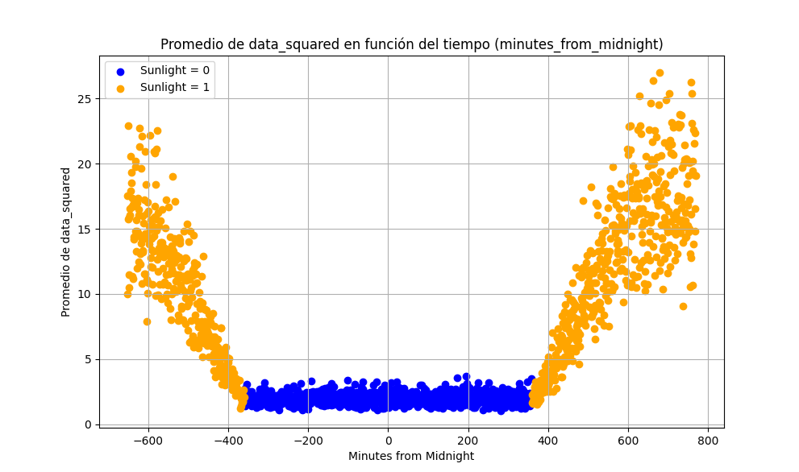
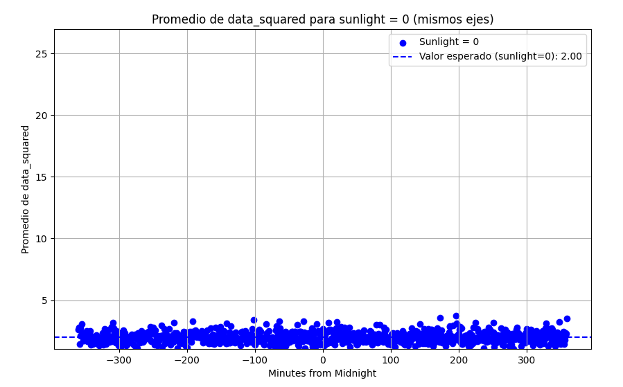
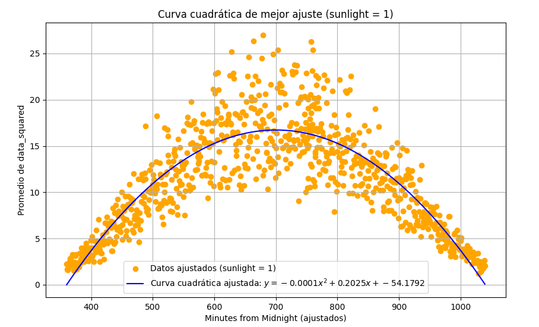

## Potencia promedio de un proceso aleatorio

La potencia de un proceso aleatorio puede definirse como el valor esperado del valor cuadrático medio como se observa en la siguiente ecuación:

$$
P = E[\overline{X}(t)^{2}]
$$

Esto puede ser aplicado directamente cuando la potencia no varía con el tiempo. Es decir, cuando el proceso es estacionario en sentido amplio. Cuando esta varía respecto al tiempo como es el caso de los datos cuando sunlight es 1 se debe aplicar la siguiente fórmula a través del uso de ```scypy integrate```

$$
\frac{1}{t_2 - t_1} {\int_{t_1}^{t_2}{X^{2}(t)dt}}
$$

Esta ecuación lo que obtiene es el promedio temporal del valor cuadrático medio, es lo mismo que para el estático pero este añade el factor de la varianza temporal.

A continuación se observa la gráfica del promedio del cuadrado de los datos a lo largo del tiempo de muestreo:



Como se observa, la gráfica sigue la misma tendencia que el promedio de los datos a lo largo del tiempo. La potencia promedio se dividirá en dos, la estática para cuando sunlight es cero y la dinámica, cuando sunlight es 1.

## Potencia promedio estática

Cuando sunlight es cero, los el promedio del cuadrado de los datos tienden a mantenerse cercanos a un valor, en este caso se usó el programa ```potencia_promedio_temporal.py``` para calcular el promedio del cuadrado de los valores originales cuando sunlight es cero, filtrando los resultados para cuando es uno. de forma que se obtiene la siguiente figura:



Como se observa, el valor esperado de los datos cuadráticos cuando es de noche es 2.00, este valor fue sencillo de conseguir debido a las características temporales que posee el proceso para estas condiciones


## Potencia promedio dinámica

A continuación, a partir del programa ```potencia_promedio_dinamica.py``` se logran filtrar los valores para cuando es de noche, dejando únicamente la parte del proceso que varía con el tiempo. Luego, a la etiqueta temporal de los valores negativos le suma 1400 para construir de mejor forma la curva de segundo orden. Por último, se obtiene la curva de mejor ajuste de esta gráfica, la cual sirvió para obtener el promedio a través de la integral utilizando ```scipy integrate```



Ahora, el programa aplica el valor esperado utilizando esta curva de mejor ajuste como función $X(t)$ de la siguiendo la siguiente ecuación:

$$
\frac{1}{t_2 - t_1} {\int_{t_1}^{t_2}{(-0.0001t^{2}+0.2025t-54.1792)dt}}
$$

El programa mismo calcula los valores de $t_2$ y $t_1$ como los valores de tiempo mayor y menor de todos los datos de "minutes_from_midnight" recopilados. 

Ahora bien, el programa indicó que el valor de potencia promedio temporal obtenida es de 11.1619. En la siguiente tabla se resumen los resultados obtenidos:


| Potencia promedio para sunlight = 0 | Potencia promedio para sunlight = 1 | 
|---------|---------|
|   2.00  |   11.1619   |  
